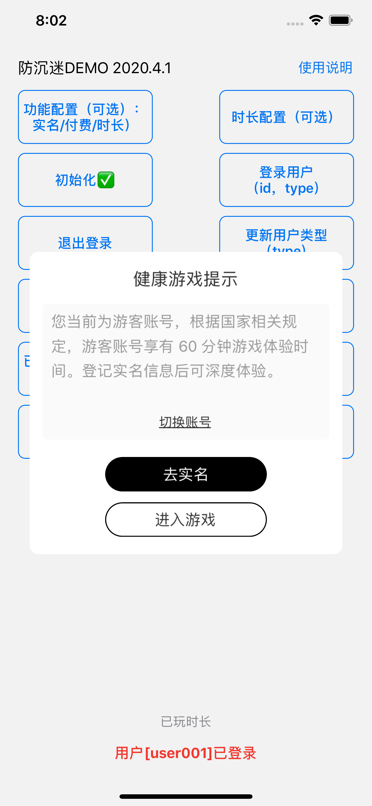
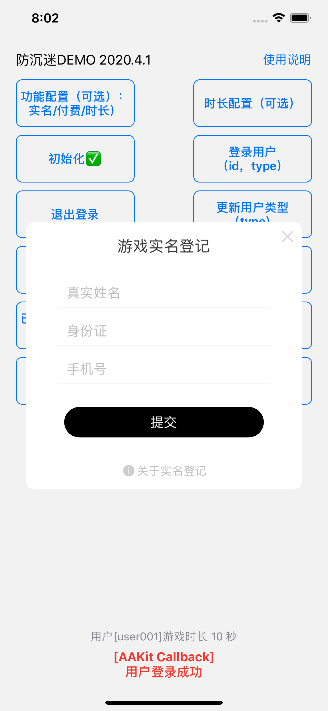
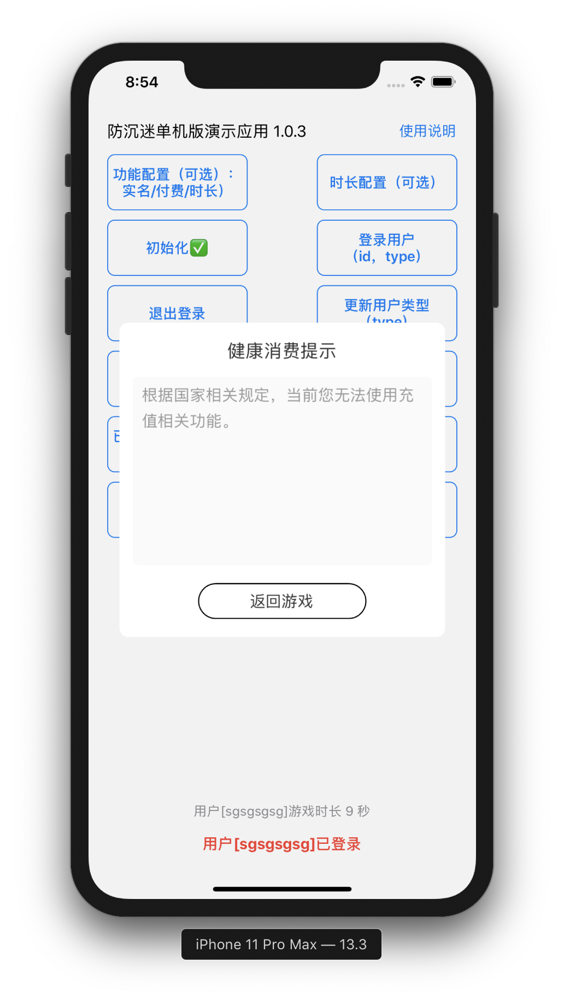

# 游戏防沉迷 AntiAddictionKit iOS 对接文档
`AntiAddictionKit` 是为了应对最新防沉迷政策而编写的一个集实名登记、防沉迷时长限制、付费限制三部分功能的组件，方便国内游戏团队快速接入游戏实现防沉迷功能从而符合政策规定。

## 接入SDK
说明：`AntiAddictionKit` iOS 模块由 Swift 编写，但接口同时支持 Swift 或 Objective-C 使用，文档中代码示例同时包含 Swift 与  Objective-C 两种示例，可根据自身项目语言类型参考。

### 手动引入 iOS 动态库文件
1. 下载最新的 Release 中的 `AntiAddictionKitiOS.zip`文件解压得到动态库`AntiAddictionKit.Framework`。
2. 直接拖入现有游戏的 Xcode 工程，请确保设置 `Xcode` - `General` - `Frameworks, Libraries, and Embedded Content`中的 `AntiAddictionKit.framework`为`Embed & Svign`。
3. 如果编译报错找不到头文件或者模块，请确保`Xcode`-`Build Settings`- `Framework Search Paths`中的路径以保证 Xcode 编译。
4. 修改 Xcode 工程的 `BuildSettings` 的 `Always Embed Swift Standard Libraries` 为 `Yes`，即`始终引入 Swift 标准库`，避免 App 启动时报错（无法找到 Swift标准库之类）。
5. 确保`Xcode`-`Build Phases`- `Embed Frameworks`中`AntiAddiction.framework`勾上`Code Sign On Copy`，否则打包提审时可能会出现审核打回（ITMS-90424: Invalid Swift Support）。
6. 添加依赖库 `libc++.tbd`
7. 开始代码接入

> 请确保以上操作。
 

```swift
// Swift
import AntiAddictionKit
```

```Objective-C
// Objective-C
@import AntiAddictionKit;
或者
#import "AntiAddictionKit/AntiAddictionKit-Swift.h";
//
```


## 1. SDK 配置（采用默认值可跳过）
### 1.1 主要功能配置：

参数 | 类型 | 默认值 | 说明 
--- | --- | --- | ---
`useSdkRealName` | `Bool` | `true` | 是否使用 SDK 实名登记功能
`useSdkPaymentLimit` | `Bool` | `true` | 是否使用 SDK 付费限制
`useSdkOnlineTimeLimit` | `Bool` | `true` | 是否使用 SDK 在线时长限制

使用示例：

```swift
// Swift
AntiAddictionKit.configuration.useSdkRealName = true
AntiAddictionKit.configuration.useSdkPaymentLimit = true
AntiAddictionKit.configuration.useSdkOnlineTimeLimit = true
```

```
// Objective-C
AntiAddictionKit.configuration.useSdkRealName = YES;
AntiAddictionKit.configuration.useSdkPaymentLimit = YES;
AntiAddictionKit.configuration.useSdkOnlineTimeLimit = YES;
```

或直接传递三个对应参数（参数顺序：`useSdkRealName`, `useSdkPaymentLimit`, `useSdkOnlineTimeLimit`)。

使用示例：

```swift
// Swift
AntiAddictionKit.setFunctionConfig(true, true, true)
```

```Objective-C
// Objective-C
[AntiAddictionKit setFunctionConfig:YES :YES :YES];
```

### 1.2 其他功能配置：
参数 | 类型 | 默认值 | 说明 
--- | --- | --- | ---
`showSwitchAccountButton` | `Bool` | `true` | SDK页面切换账号按钮是否显示，默认显示 `true`，单机游戏无账号系统可设置为`false`隐藏该按钮

使用示例：

```swift
// Swift
AntiAddictionKit.configuration.showSwitchAccountButton = true
```

```Objective-C
// Objective-C
AntiAddictionKit.configuration.showSwitchAccountButton = YES;
```

### 1.3 时长配置：
 防沉迷限制时长配置 |类型（单位秒）| 默认值| 说明 
--- | --- | --- | ---
`minorCommonDayTotalTime` | `Int` | `5400` | 未成年人非节假日游戏限制时长`90`分钟
`minorHolidayTotalTime` | `Int` | `10800` | 未成年人节假日游戏限制时长`180`分钟
`guestTotalTime` | `Int` | `3600` | 游客用户（未实名）节假日游戏限制时长`60`分钟
`firstAlertTipRemainTime` | `Int` | `900` | 第一次提醒用户时的剩余时长`15`分钟
`countdownAlertTipRemainTime` | `Int` | `60` | 开始倒计时提醒用户时的剩余时长`1`分钟

使用示例：

```swift or Objective-C
// Swift
AntiAddictionKit.configuration.minorCommonDayTotalTime = 5400
AntiAddictionKit.configuration.minorHolidayTotalTime = 10800
AntiAddictionKit.configuration.guestTotalTime = 3600
AntiAddictionKit.configuration.firstAlertTipRemainTime = 900
AntiAddictionKit.configuration.countdownAlertTipRemainTime = 60
```

### 1.4 宵禁配置：
 宵禁时间配置 |类型（单位小时）| 默认值| 说明 
--- | --- | --- | ---
`curfewHourStart` | `Int` | `22`，即晚上10点 | 未成年人防沉迷宵禁开始时间（24小时制）
`curfewHourEnd` | `Int` | `8`，即早上8点| 未成年人节假日游戏限制时长（24小时制）

使用示例：

```swift or Objective-C
// Swift
AntiAddictionKit.configuration.curfewHourStart = 22
AntiAddictionKit.configuration.curfewHourEnd = 8
```

### 1.5 支付限制金额配置（单位分）：
 防沉迷支付限制金额配置 |类型（单位分）| 默认值| 说明 
--- | --- | --- | ---
`singlePaymentAmountLimitJunior` | `Int` | `5000` | 8-15 岁单笔付费额度限制，单位分（默认 5000 分，即 50 元）
`mouthTotalPaymentAmountLimitJunior` | `Int` | `20000` | 8-15 岁每月总付费额度限制，单位分（默认 20000分，即 200 元）
`singlePaymentAmountLimitSenior` | `Int` | `10000` | 16-17 岁单笔付费额度限制，单位分（默认 10000 分，即 100 元）
`mouthTotalPaymentAmountLimitSenior` | `Int` | `40000` | 16-17岁每月总付费额度限制，单位分（默认40000分，即 400 元）
使用示例：

```swift or Objective-C
// Swift
AntiAddictionKit.configuration.singlePaymentAmountLimitJunior = 5000
AntiAddictionKit.configuration.mouthTotalPaymentAmountLimitJunior = 20000
AntiAddictionKit.configuration.singlePaymentAmountLimitSenior = 10000
AntiAddictionKit.configuration.mouthTotalPaymentAmountLimitSenior = 40000
```

## 2. 初始化

示例如下：

```swift
// Swift
 AntiAddictionKit.init(yourCallbackDelegate);
```

```Objective-C
// Objective-C
[AntiAddictionKit init:<YourCallbackTarget>];
```

其中 `<YourCallbackTarget>` 为游戏内接受回调的对象。
回调中会返回对应的回调类型码 `code` 和相应信息 `message`。

<a name="回调类型"></a>

回调类型 | `code` |  触发逻辑 | `message`（仅供游戏接受回调时参考）
--- | --- | --- | ---
LOGIN\_SUCCESS | 500 | 游戏调用 login 后用户完成登录流程 | 具体见SDK回调
SWITCH_ACCOUNT | 1000 | 切换账号，当用户因防沉迷机制受限时，选择切换账号时会触发 | -
USER\_TYPE\_CHANGED | 1500 | 用户类型变更，通过SDK完成实名会触发 | -
REAL\_NAME\_COMPLETED | 1010 | 仅当游戏主动调用 openRealName 方法时，如果成功会触发 | -
REAL\_NAME\_CANCELLED | 1015 | 仅用游戏主动调用 openRealName 方法时，如果用户取消会触发 | -
PAY\_NO\_LIMIT | 1020 | 付费不受限，sdk检查用户付费无限制时触发| -
PAY\_LIMIT | 1025 | 付费受限，付费受限触发,包括游客未实名或付费额达到限制等 | -
TIME\_LIMIT | 1030 | 时间受限，未成年人或游客游戏时长已达限制或受到宵禁限制无法游戏时，通知游戏 | -
OPEN\_REAL\_NAME | 1060 | SDK请求打开游戏的实名窗口，当游戏查询支付或聊天限制时触发 | -
CHAT\_NO\_LIMIT | 1080 | 聊天无限制，用户已通过实名，可进行聊天 | -
CHAT\_LIMIT | 1090 | 聊天限制，用户未通过实名，不可进行聊天 | -
AAK\_WINDOW\_SHOWN | 2000 | 用户打开 SDK 页面，游戏暂停
AAK\_WINDOW\_DISMISS | 2500 | SDK 页面关闭，游戏恢复

## 3. 登录，登出，更新信息

三个接口包括用户登录、更新用户实名信息以及登出时调用。

<a name="用户相关参数"></a>

用户相关参数 | 类型 | 说明
--- | --- | ---
userId | `String` | 用户的唯一标识
userType | `Int` | 用户实名类型

<a name="用户类型"></a>

用户类型 userType | 参数值 | 说明
--- | --- | ---
USER\_TYPE\_UNKNOWN | 0 | 未实名
USER\_TYPE\_CHILD | 1 | 未成年人（8岁以下）
USER\_TYPE\_TEEN | 2 | 未成年人（8-16岁）
USER\_TYPE\_YOUNG | 3 | 未成年人（16-17岁）
USER\_TYPE\_ADULT | 4 | 成年人（18岁及以上）

### 3.1 登录
游戏登录时调用，如果单机游戏无账号系统，可在登录时直接生成并保存 UUID 保证用户唯一性，userType 传入0，进而模拟账号系统。同时单机游戏可通过`showSwitchAccountButton`来关闭切换账号按钮，保证单一设备只有唯一用户。
调用示例：

```swift
// Swift
let userId = "user001"
let userType = 3
AntiAddictionKit.login(userId, userType)
```

```Objective-C
// Objective-C
NSString *userId = @"user001";
NSInteger userType = 3;
[AntiAddictionKit login:userId :userType];
```

### 3.2 更新用户类型
游戏通过第三方实名获取用户信息时，调用此方法从而更新SDK当前用户信息，调用示例：

```swift
// Swift
let userType = 4
AntiAddictionKit.updateUserType(userType)
```

```Objective-C
// Objective-C
NSInteger userType = 4;
[AntiAddictionKit updateUserType:userType];
```

注：`updateUserType 方法`只在游戏用户已经登录成功后能调用。

### 3.3 登出

调用此方法后 SDK 会退出当前用户信息停止计时，因此游戏需要停止游戏回到登录前状态。

```swift
// Swift
AntiAddictionKit.logout()
```

```Objective-C
// Objective-C
[AntiAddictionKit logout];
```

## 4.付费
游戏在收到用户的付费请求后，调用 SDK 的对应接口来判断当前用户的付费行为是否被限制，示例如下：

```swift
// Swift
 AntiAddictionKit.checkPayLimit(100)
```

```Objective-C
// Objective-C
[AntiAddictionKit checkPayLimit:100];
```

接口参数表示付费的金额，单位为分（例如1元道具=100分）。当用户可以发起付费时，SDK 会调用回调 [PAY_NO_LIMIT](#回调类型) 通知游戏,否则调用 [PAY\_LIMIT](#回调类型);   
当用户完成付费行为时，游戏需要通知 SDK ，更新用户状态，示例如下：

```swift
// Swift
 AntiAddictionKit.paySuccess(100)
```

```Objective-C
// Objective-C
[AntiAddictionKit paySuccess:100];
```

参数为本次充值的金额，**单位为分，(0.01元)**。

> 注意：如果用户在付费过程中需要打开第三方页面进行实名，实名完成后，游戏除了要调用 [updateUserType](#更新用户类型) , 还需再次调用 [checkPayLimit] 接口，SDK 才能判断用户类型并发出 [是否付费限制] (#回调类型) 的回调。

## 5.聊天
游戏在需要聊天时，调用 SDK 接口判断当前用户是否实名，示例如下：

```swift
// Swift
 AntiAddictionKit.checkChatLimit()
```

```Objective-C
// Objective-C
[AntiAddictionKit checkChatLimit];
```

当用户可以聊天时， SDK 会通过聊天回调 [CHAT\_NO\_LIMIT](#回调类型) 来通知游戏，否则就会直接让用户进行实名。如果此时需要打开第三方的实名页面，SDK 会调用 [OPEN\_REAL\_NAME](#回调类型) 回调，否则打开 SDK 的实名页面。如果打开的是 SDK 内的实名页面，实名失败就会触发[CHAT\_LIMIT](#回调类型) 回调，成功则触发 [CHAT\_NO\_LIMIT](#回调类型)。

> 注意：如果用户在判断聊天限制过程中需要打开第三方页面进行实名，实名完成后，游戏需要调用 [ `updateUserType`](#更新用户类型) 接口, 还需再次调用 [checkChatLimit]() 接口，SDK 才能判断用户类型并发出 [是否聊天限制](#回调类型) 的回调。

## 6.时长统计
如果步骤一配置的 `useSdkOnlineTimeLimit` 值为 `true`，则 SDK 会根据当前政策主动提醒和限制游戏时长，反之无任何时长限制。

## 7.获取用户类型
SDK 初始化后，游戏可以获取 SDK 内保存的用户类型信息。如果游戏之前已设置过用户，会返回该用户的正常类型信息（0，1，2，3，4），否则返回 -1。调用示例如下：

```swift
// Swift
let userType = AntiAddictionKit.getUserType("userId")
```

```Objective-C
// Objective-C
NSInteger userType = [AntiAddictionKit getUserType:@"userId"];
```

参数是用户的唯一标识字符串，返回值参考[用户类型](#用户类型)。

## Demo 截图

<div align="left">



</div>
